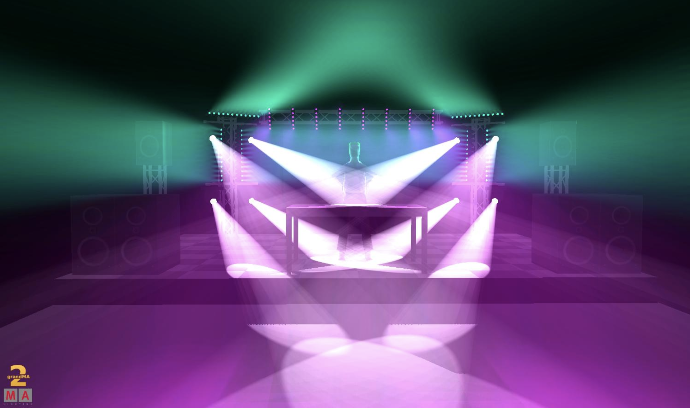
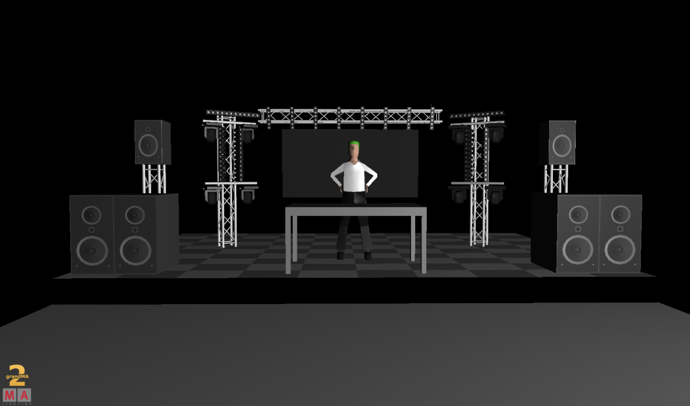
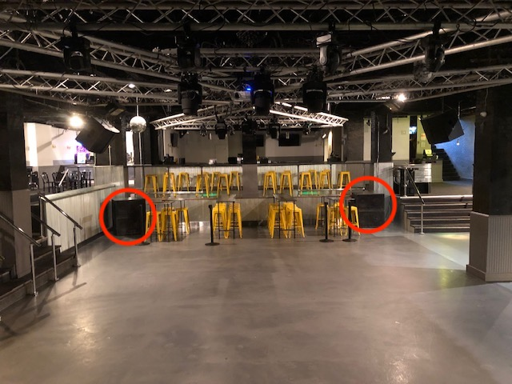

# UP & UP FESTIVAL @ PENN STATE

---

## The Current Quote

**For just slightly over $6k,** we are getting a full-fledged audio, lighting, and video wall setup to really flip The Basement *upside down*. 

> <u>**You can check out the price sheet at this link here:**</u>  <https://docs.google.com/spreadsheets/d/18Cm9NGH90IaBfm_uAvTvm0gL7M9T09WDqgM2TYSIhyQ/edit?usp=sharing>

The guys over at **SLM Entertainment** were extremely generous enough to give us a **57% discount** on all of their in-house gear and services! 

#### NOTE:

There are 4 things **NOT listed in this Price Point** that we still need confrimation of. 3 of these things were mentioned in yesterday's email. Those four things are:

1. Whether or not a **Media Server** is required - the Rider does not specify one, so we would like to know if the VJ already has one or not. 

2. What the situation is with **Barriers** - whether you guys are still handling that or if we're in charge of sourcing them *(if you think we need them.)*

3. How you would like to handle payment for **my Coordination Services**, whether it's supposed to be in this budget or to be dealt with later, and at what rate? 

4. We have gotten mixed answers regarding the **Power Situation** at the venue. They say they have 4-5 120v/2amp circuits, and that a 220v tie in *exists*, but no idea if they have an in-house distro. Waiting to hear back from Curt about all of this today. 

    

------

## Mockups

------

## Side Note

- We are still waiting back on a reply from one more video wall rental company today *(Thursday)* to see if we can **possibly lower that wall price even further!** 

- If you look at the tabs on the bottom of the spreadsheet, we kept the original "Ideal $9k" budget setup they put together that maximizes on fulfilling Rider Spec. 

  - *(You will notice that some of the items on the "$6k" Quote have a quantity of <u>zero</u> - these were the items we cut from the 9k budget to create the 6k one, like CO2 and some Beam Moving heads, etc.)*

  

-----

## To Answer some of the "Why"s

#### **"Why do we need an audio system? Doesn't the Basement have one?"**

- Everyone we've asked so far has said the same thing: "That system is outdated and not powerful enough for an EDM show."

  - I was unaware that the quality of the system is as poor as everyone is saying it is now. I haven't been there since before they remodeled it last year.
  - The subs appear to be only 15" woofers (which is not up to Rider Spec and was not what I had originally been told by the venue)
  - The current layout of the system is also terrible due to the tops now being in 4 corners of the dancefloor *(causing phase issues like comb filtering)* and the subs being in the **back of the dance floor.**
    - *By result, Slushii and the people in the front Row would be feeling the kick **at a delay. Not good.***
  - We all know the sound quality is the number one priority to get everyone moving. SLM and myself

- This also solves the 6-9pm formal dilemma because now the DJ can just run through the house system without needing to charge Engineer hours. 

  

  

  **FIGURE 1: Location of the Subwoofers (Picture taken from stage)**

#### **"Why does this package cost $500 more than the Alabama show, when the stage is included there?"**

- For starters, the Alabama market is much different than Pennsylvania. This area of Pennsylvania has more smaller, specialized companies with newer higher quality gear than big "all in one" companies that have speakers and lights from the 90's. While we found that one "All in one" that would do the stage/lighting/audio for the outdoor stage, we still would have needed a video wall and lighting upgrades.

  - *I'm assuming whatever company is running the Alabama show owns all of that gear/uses a similar setup for other shows quite repetitively.* 

- They don't have to accommodate to fit within a innacuratley spec'd room because the outdoors are infinite and their truck is available to them to test on at any time.

  

- At Penn State, we're playing a game of "get as modular yet powerful and power efficient gear we can," because:

  - *There's no ramp to load into the venue with - stairs only apparently.* 
  - *There are only a couple 120v circuits and 1 220v circuit, with possibly no in house distro for the 220 volt so we may have to source one depending on what Curt says today,* 
  - *The DJ booth riser is apparntly immovable (and off-center), which is news to us as of yesterday, versus what we were originally told,*
  - *And the measurements we've been going off keep getting revised/re-sent by the venue as they did not have a professionally done blueprint or plot beforehand.*
    - *(Remember, I had to do all the measurements/power testing myself last November and got all the specs in one day, while here we're getting an ever-changing trickle of information.)*

  

  - This rig is a rig that is tailored to this show and venue and not going to be repeated/rented for a month and used on 5 other shows. And again, that price point is after the SLM 57% discount on all their in-house gear/services.

    

--------

## Closing Remarks:

We hope this makes more sense now, and would like to apologize again for almost giving Steve L a heart attack about that **"$9k Ideal Rig"** that I sent him Wednesday morning. I forgot to stress that that was our standalone *sculpting block*of a rig to carve out into something more budget friendly. While we originally planned on just adding to the systems there, we strongly belive that this standalone system will make everyone's lives easier/provide a better quality show/be much more reliable and easier to setup than triying to metaphorically do the equivilent of *"adding a racing engine to a 1998 honda civic that had got body work done to look like a 2018 civic."*

I am also sorry that this became much more of an ordeal than we thought - I was told the Basement's systems had been upgraded during the renovation, but it seems the sound quality got worse - and the last thing we want to do is have a flop at such a large college like Penn State. All we need now are those four pieces of info at the beginning, and then we can be ready to go.

I actually think flipping The Basement on it' head like this will be good press for the Festival because everyone that missed out becuase they though **"Eh, it's in The Basement?"** will be like ***"They did ALL OF THAT that IN THE BASEMENT?"*** The kids who miss out/are dissapointed as of this moment that it's at The Basement will most definitly regret their decisions to not go once they see what's possible there. 

The only thing making us wary about going with this quote right now are is that power situation mentioned in the beginning. The last thing we want is to trip a circuit/halt the performance on such a major show because we couldn't setup a day earler/propelry test power ourselves befoerhand. This venue is not as "plug and play'" or " here's all the certified specs" as I had originally thought. I take that fault on myself because  I should have seen the warning signs earlier. But, after around 25-35 hours this week alone, we have a plan, and we'll make it work, and it'll blow the roof off The Basement. We just need to get actual confirmation about the power stuff ASAP, and answers to both of the the VJ/Barrier questions. 

------

#### Thanks again for your patience and support on this project!

####  We look forward to hearing what you think! 

~ Ben Warters - Oak Ridge Productions, LLC 

